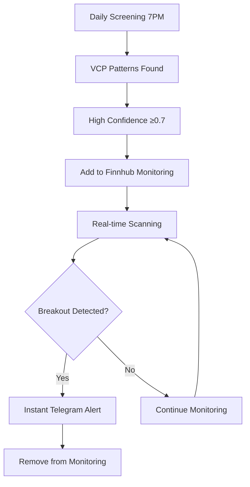

# VCP Screening System Architecture

This document describes the enhanced two-tier architecture of the VCP screening system.

## 🏗️ System Overview

The system implements a **two-tier approach** for comprehensive VCP pattern detection and monitoring:

1. **Tier 1: Daily Screening** - Broad market analysis
2. **Tier 2: Real-time Monitoring** - Focused breakout detection

## 📊 Tier 1: Daily Screening (7 PM ET)

### Purpose
- Screen all ~500 S&P 500 stocks for VCP patterns
- Identify 3-15 high-quality VCP candidates daily
- Generate comprehensive reports and notifications

### Data Flow
```
S&P 500 Tickers → yfinance → VCP Detection → Telegram Report
                      ↓
                Alpha Vantage (backup)
```

### Components
- **Ticker Fetcher**: Wikipedia scraping + static fallback
- **Data Pipeline**: yfinance primary, Alpha Vantage backup
- **VCP Detector**: Mark Minervini's methodology implementation
- **Report Generator**: CSV, JSON, GitHub issues, Telegram notifications

### Output
- Daily Telegram summary with top VCP matches
- CSV file with all detected patterns
- JSON summary with execution statistics
- VCP candidates list for real-time monitoring

## ⚡ Tier 2: Real-time Monitoring (Market Hours)

### Purpose
- Monitor 5-20 VCP candidates identified by daily screening
- Detect breakouts as they happen
- Send instant Telegram alerts for trading opportunities

### Data Flow
```
VCP Candidates → Finnhub Real-time → Breakout Detection → Instant Alert
                                          ↓
                                   Volume Confirmation
```

### Components
- **Finnhub Monitor**: Real-time price and volume data
- **Breakout Detector**: Volume-confirmed breakout identification
- **Alert System**: Instant Telegram notifications

### Schedule
- Runs every 2 minutes during market hours (9:30 AM - 4:00 PM ET)
- Only monitors symbols with confidence ≥ 0.7 from daily screening
- Automatic cleanup of old candidates (14 days)

## 🔄 Integration Flow



## 🔌 API Architecture

### Data Sources by Function

| Function | Primary | Backup | Rate Limit |
|----------|---------|--------|------------|
| Daily Screening | yfinance | Alpha Vantage | Unlimited / 500/day |
| Real-time Monitoring | Finnhub | - | 60/minute |
| Notifications | Telegram | GitHub Issues | Unlimited |

### API Usage Optimization

**yfinance (Primary)**:
- ✅ Free unlimited requests
- ✅ 12+ weeks historical data
- ✅ Batch processing friendly
- ⚠️ Occasional rate limiting

**Alpha Vantage (Backup)**:
- ✅ 500 requests/day free tier
- ✅ High-quality data (NASDAQ vendor)
- ✅ Reliable fallback
- ⚠️ 5 requests/minute limit

**Finnhub (Real-time)**:
- ✅ 60 requests/minute free tier
- ✅ Real-time price/volume data
- ✅ Perfect for monitoring 10-20 stocks
- ⚠️ Limited historical data on free tier

## 📱 Notification Architecture

### Telegram Bot (Primary)
- **Daily Reports**: Comprehensive VCP summaries at 7 PM ET
- **Breakout Alerts**: Instant notifications during market hours
- **System Updates**: Monitoring changes and error alerts
- **Private Channel**: Secure, personal notifications

### GitHub Integration (Secondary)
- **Daily Issues**: Searchable daily reports
- **Artifact Storage**: CSV/JSON file preservation
- **Workflow Logs**: Detailed execution tracking

## 🏃‍♂️ Execution Flow

### Daily Screening Workflow
1. **7:00 PM ET**: GitHub Actions triggers daily screening
2. **Data Fetching**: yfinance → Alpha Vantage fallback
3. **VCP Analysis**: All ~500 S&P 500 stocks analyzed
4. **Report Generation**: CSV, JSON, GitHub issue created
5. **Telegram Notification**: Daily summary sent
6. **Monitoring Update**: High-confidence VCP candidates added to real-time monitoring

### Real-time Monitoring Workflow
1. **Every 2 minutes** (9:30 AM - 4:00 PM ET): Monitor active VCP candidates
2. **Market Hours Check**: Skip if market closed
3. **Breakout Detection**: Price/volume analysis for each candidate
4. **Alert Generation**: Instant Telegram notification for breakouts
5. **Cleanup**: Remove completed/old candidates

## 📊 Data Storage

### Daily Reports Directory
```
daily_reports/
├── vcp_matches_YYYYMMDD.csv          # Daily VCP results
├── vcp_summary_YYYYMMDD.json         # Execution summary
├── github_report_YYYYMMDD.md         # GitHub issue content
└── vcp_monitoring_candidates.json    # Real-time monitoring list
```

### GitHub Artifacts
- 30-day retention for all generated reports
- Downloadable via GitHub Actions interface
- Historical analysis and pattern tracking

## 🔒 Security Architecture

### API Key Management
- All API keys stored as GitHub repository secrets
- Environment variable injection at runtime
- No hardcoded credentials in codebase

### Private Communications
- Telegram bot uses private chat (your chat ID only)
- Bot token access restricted to repository
- No public data exposure

## 🎯 Performance Characteristics

### Daily Screening
- **Duration**: 10-30 minutes for full S&P 500
- **Data Volume**: ~60MB per full screening
- **Detection Rate**: 0.5-2% of stocks (3-10 patterns typical)
- **Resource Usage**: Free GitHub Actions limits

### Real-time Monitoring
- **Latency**: 1-3 minutes for breakout detection
- **API Efficiency**: 60 calls/minute handles 20+ symbols
- **Alert Speed**: Sub-30 second Telegram delivery
- **Market Hours Only**: No unnecessary weekend/evening execution

## 🔄 Scalability Considerations

### Current Limits
- **Symbols**: 500+ S&P 500 stocks (daily)
- **Monitoring**: 20 concurrent VCP candidates
- **Frequency**: Daily screening + 2-minute real-time scans
- **Cost**: $0/month (all free tiers)

### Expansion Options
- **Additional Indices**: Russell 2000, NASDAQ 100
- **International Markets**: European, Asian markets
- **Higher Frequency**: 1-minute real-time scanning
- **Advanced Analytics**: Machine learning pattern refinement

## 🛠️ Maintenance Architecture

### Automated Maintenance
- **Old Candidate Cleanup**: 14-day automatic removal
- **Data Validation**: Built-in quality checks
- **Error Handling**: Graceful degradation and notification
- **API Failover**: Automatic backup source usage

### Manual Maintenance
- **Weekly Review**: Detection accuracy assessment
- **Monthly Tuning**: VCP parameter optimization
- **Quarterly Updates**: Static ticker list refresh
- **Performance Monitoring**: GitHub Actions execution tracking

This architecture provides a robust, scalable, and cost-effective solution for comprehensive VCP pattern detection and real-time breakout monitoring.