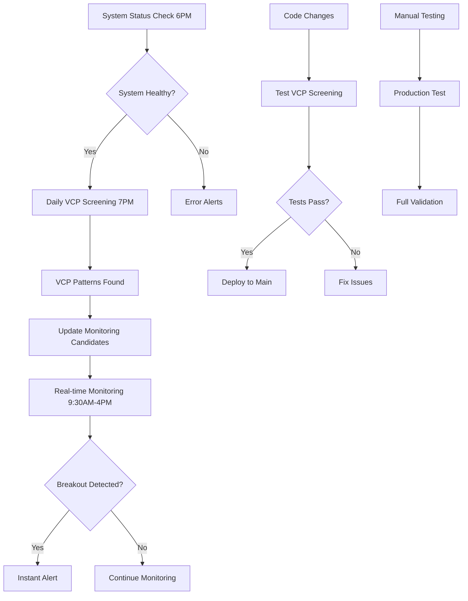

# GitHub Actions Workflows Guide

This guide provides comprehensive documentation for all 5 GitHub Actions workflows in the VCP screening system.

## 🎯 Workflow Overview

The system uses a **two-tier approach** with multiple supporting workflows:

- **Tier 1**: Daily screening of all S&P 500 stocks
- **Tier 2**: Real-time monitoring of VCP candidates
- **Support**: Health monitoring, testing, and production validation

## 🕐 Daily Schedule

```
6:00 PM ET - System Status Check
7:00 PM ET - Daily VCP Screening
9:30 AM - 4:00 PM ET - Real-time Monitoring (every 2 minutes)
```

---

## 1. 📊 Daily VCP Screening

**File**: `.github/workflows/daily-vcp-screening.yml`

### Purpose
Primary production workflow that screens all ~500 S&P 500 stocks for VCP patterns daily.

### Schedule
- **Automatic**: Monday-Friday at 7:00 PM ET (11:00 PM UTC)
- **Cron**: `'0 23 * * 1-5'`
- **Manual**: Yes, with configurable parameters

### Workflow Inputs (Manual Trigger)
```yaml
max_symbols:
  description: 'Maximum number of symbols to process (leave empty for full S&P 500)'
  required: false
  default: ''

dry_run:
  description: 'Dry run (fetch data only, skip analysis)'
  required: false
  default: 'false'
  type: boolean

force_production:
  description: 'Force production mode (scan full S&P 500 even in manual run)'
  required: false
  default: 'false'
  type: boolean
```

### Execution Logic

#### Production Mode (Automatic)
- Triggered by: `schedule` event or `force_production: true`
- Processes: All ~500 S&P 500 stocks
- Duration: 10-30 minutes
- Notifications: Full Telegram reports

#### Test Mode (Manual)
- Triggered by: Manual execution without `force_production`
- Processes: Limited symbols (configurable via `max_symbols`)
- Duration: 1-5 minutes
- Notifications: Test notifications

### Key Features

1. **Intelligent Mode Detection**
   ```bash
   if [ "${{ github.event_name }}" = "schedule" ] || [ "${{ github.event.inputs.force_production }}" = "true" ]; then
     SCREENING_MODE="PRODUCTION"
   else
     SCREENING_MODE="TEST"
   fi
   ```

2. **Report Generation**
   - CSV files: `daily_reports/vcp_matches_YYYYMMDD.csv`
   - JSON summaries: `daily_reports/vcp_summary_YYYYMMDD.json`
   - GitHub reports: `daily_reports/github_report_YYYYMMDD.md`

3. **GitHub Issue Creation**
   - Automatic issue creation with formatted reports
   - Labels: `['vcp-screening', 'automated-report']`
   - Title: `VCP Screening Report - YYYY-MM-DD`

4. **VCP Monitoring Integration**
   - Updates `vcp_monitoring_candidates.json`
   - Adds high-confidence patterns (≥0.7) to real-time monitoring
   - Sends monitoring update notifications

5. **Repository Management**
   - Commits daily reports to repository
   - Git configuration for GitHub Actions
   - Automatic push to main branch

### Usage Examples

**Manual Test Run**:
```bash
# Go to: GitHub Actions → Daily VCP Screening → Run workflow
# Set: max_symbols = 10, dry_run = false, force_production = false
```

**Manual Production Run**:
```bash
# Go to: GitHub Actions → Daily VCP Screening → Run workflow
# Set: force_production = true (leave other fields empty)
```

**Dry Run Testing**:
```bash
# Go to: GitHub Actions → Daily VCP Screening → Run workflow
# Set: max_symbols = 5, dry_run = true
```

---

## 2. ⚡ Real-time VCP Monitoring

**File**: `.github/workflows/realtime-vcp-monitoring.yml`

### Purpose
Monitors VCP candidates identified by daily screening for real-time breakouts during market hours.

### Schedule
- **Automatic**: Every 2 minutes during market hours (9:30 AM - 4:00 PM ET, Monday-Friday)
- **Cron**: `'*/2 13-20 * * 1-5'` (UTC time)
- **Manual**: Yes, for testing

### Key Features

1. **Market Hours Validation**
   ```python
   # Only runs during market hours
   current_time = datetime.now(timezone.utc)
   market_open = current_time.replace(hour=13, minute=30)  # 9:30 AM ET
   market_close = current_time.replace(hour=20, minute=0)  # 4:00 PM ET
   ```

2. **Candidate Management**
   - Loads candidates from `daily_reports/vcp_monitoring_candidates.json`
   - Monitors only high-confidence patterns (≥0.7)
   - Automatic cleanup of old candidates (14+ days)

3. **Breakout Detection**
   - Price breakout above resistance levels
   - Volume confirmation (50% above average)
   - Resistance level calculation from VCP analysis

4. **Instant Notifications**
   - Immediate Telegram alerts for breakouts
   - Rich formatting with pattern details
   - Trading opportunity information

### Finnhub API Integration
- **Rate Limit**: 60 requests/minute (free tier)
- **Data**: Real-time price and volume
- **Efficiency**: Can monitor 20+ symbols within limits

### Usage Examples

**Manual Test**:
```bash
# Go to: GitHub Actions → Real-time VCP Monitoring → Run workflow
# This will run monitoring logic once for testing
```

---

## 3. 🔍 VCP System Status Check

**File**: `.github/workflows/system-status.yml`

### Purpose
Comprehensive health monitoring of all system components before daily screening.

### Schedule
- **Automatic**: Monday-Friday at 6:00 PM ET (10:00 PM UTC)
- **Cron**: `'0 22 * * 1-5'`
- **Manual**: Yes, for on-demand health checks

### Health Checks

1. **Telegram Bot Validation**
   ```python
   bot = TelegramBot()
   validation = bot.validate_configuration()
   if validation['bot_accessible'] and validation['chat_accessible']:
       status = 'operational'
   ```

2. **Ticker Fetching Test**
   ```python
   fetcher = SP500TickerFetcher()
   tickers = fetcher.get_sp500_tickers()

   if len(tickers) >= 400:
       status = 'operational'  # Full list retrieved
   elif len(tickers) >= 100:
       status = 'fallback'     # Using static fallback
   ```

3. **Data Source Validation**
   ```python
   data_fetcher = DataFetcher()
   test_data = data_fetcher.fetch_stock_data('AAPL', weeks=2)

   if test_data is not None and len(test_data) > 5:
       status = 'operational'
   ```

4. **Workflow File Verification**
   - Checks existence of required workflow files
   - Validates workflow schedule configurations

### Status Notifications
- **Telegram**: System health summary with emojis
- **Components**: Individual status for each system component
- **Overall Health**: Green (healthy) or Red (issues detected)

### Usage Examples

**Manual Health Check**:
```bash
# Go to: GitHub Actions → VCP System Status Check → Run workflow
# Provides immediate system health assessment
```

---

## 4. 🧪 Production VCP Screening Test

**File**: `.github/workflows/production-test.yml`

### Purpose
Full production environment simulation with safety confirmation to prevent accidental execution.

### Schedule
- **Manual Only**: No automatic schedule
- **Safety**: Requires typing "CONFIRM" to execute

### Workflow Input
```yaml
confirm_full_screening:
  description: 'Type "CONFIRM" to run full S&P 500 screening'
  required: true
  default: ''
```

### Safety Validation
```bash
if [ "${{ github.event.inputs.confirm_full_screening }}" != "CONFIRM" ]; then
  echo "❌ Must type 'CONFIRM' to run production test"
  exit 1
fi
```

### Key Features

1. **Complete Production Simulation**
   - Scans all ~500 S&P 500 stocks
   - Uses identical environment to daily screening
   - Expected duration: 15-30 minutes

2. **Performance Analysis**
   ```bash
   START_TIME=$(date +%s)
   # ... screening execution ...
   END_TIME=$(date +%s)
   DURATION=$((END_TIME - START_TIME))
   ```

3. **Detection Rate Validation**
   ```bash
   DETECTION_RATE=$(echo "scale=2; $TOTAL_PATTERNS * 100 / $SYMBOLS_SCANNED" | bc -l)

   # Validate realistic rate (0.5-5%)
   if (( $(echo "$DETECTION_RATE >= 0.5" | bc -l) )) && (( $(echo "$DETECTION_RATE <= 5.0" | bc -l) )); then
     echo "✅ Detection rate is realistic"
   ```

4. **Detailed Analysis**
   - Total patterns found
   - High confidence patterns (≥0.8)
   - Medium confidence patterns (0.5-0.8)
   - Top patterns display

### Usage Examples

**Full Production Test**:
```bash
# Go to: GitHub Actions → Production VCP Screening Test → Run workflow
# Type: "CONFIRM" in the confirmation field
# Wait: 15-30 minutes for completion
# Review: Download artifacts for detailed analysis
```

---

## 5. 🔧 Test VCP Screening

**File**: `.github/workflows/test-vcp-screening.yml`

### Purpose
Development testing and continuous integration for code changes.

### Schedule
- **Automatic**: On push/PR to `main` or `develop` branches
- **Manual**: No manual trigger

### Test Components

1. **Ticker Fetching Test**
   ```python
   fetcher = SP500TickerFetcher()
   tickers = fetcher.get_sp500_tickers()

   # Flexible validation
   if len(tickers) >= 400:
       print('✅ Full S&P 500 list')
   elif len(tickers) >= 100:
       print('⚠️ Fallback list (acceptable)')
   ```

2. **Data Pipeline Test**
   ```python
   fetcher = DataFetcher()
   test_symbols = ['AAPL', 'MSFT', 'GOOGL']
   data = fetcher.fetch_multiple_stocks(test_symbols, weeks=4)
   ```

3. **VCP Detection Test**
   ```bash
   python src/vcp_detector.py
   ```

4. **End-to-End Integration Test**
   ```bash
   python vcp_screen.py --max-symbols 10 --verbose
   ```

### System Dependencies
```bash
sudo apt-get update
sudo apt-get install -y libxml2-dev libxslt-dev
```

### Validation Checks
- Report file generation
- CSV and JSON output verification
- Error handling validation
- Component isolation testing

---

## 🎯 Workflow Interaction Flow



## 🔧 Troubleshooting

### Common Issues

1. **Workflow Not Triggering**
   - Check repository Actions are enabled
   - Verify cron syntax and timezone
   - Ensure repository is not inactive (60-day limit)

2. **API Rate Limits**
   - yfinance: Use delays between requests
   - Alpha Vantage: Monitor 500/day limit
   - Finnhub: Stay within 60/minute limit

3. **Missing Secrets**
   - Required: `TELEGRAM_BOT_TOKEN`, `TELEGRAM_CHAT_ID`
   - Optional: `ALPHA_VANTAGE_API_KEY`, `FINNHUB_API_KEY`
   - Add in: Repository Settings → Secrets and variables → Actions

4. **Workflow Failures**
   - Check Actions logs for detailed error messages
   - Verify all dependencies in `requirements.txt`
   - Ensure system dependencies are installed

### Debug Commands

**Check Workflow Status**:
```bash
# GitHub CLI
gh run list --workflow="daily-vcp-screening.yml"
gh run view <run-id> --log
```

**Local Testing**:
```bash
# Test individual components
python src/ticker_fetcher.py
python src/data_fetcher.py
python vcp_screen.py --max-symbols 5 --verbose
```

---

## 📈 Performance Characteristics

| Workflow | Duration | API Calls | Cost | Frequency |
|----------|----------|-----------|------|-----------|
| Daily Screening | 10-30 min | 500+ | Free | Daily |
| Real-time Monitoring | 30-60 sec | 10-20 | Free | Every 2 min |
| System Status | 2-5 min | 10-15 | Free | Daily |
| Production Test | 15-30 min | 500+ | Free | Manual |
| Test Screening | 3-8 min | 10-15 | Free | Per commit |

## 🚀 Getting Started

1. **Enable Workflows**: Ensure GitHub Actions are enabled in repository settings
2. **Add Secrets**: Configure required API keys and tokens
3. **Test System**: Run "VCP System Status Check" manually
4. **Verify Daily**: Wait for first automatic daily screening at 7 PM ET
5. **Monitor Real-time**: Observe real-time monitoring during market hours

Your VCP screening system is now fully documented and ready for automated operation!